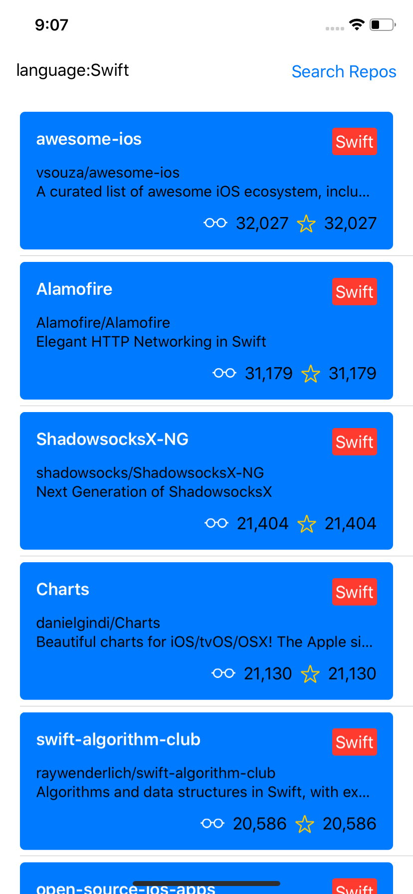

# SwiftUI + Combine Example Project

## Requires 
* XCode 11 beta 2 to work.  This is when Apple included Foundation support for Combine

## API
* Utilises GitHubs repository search API (rate limited) https://developer.github.com/v3/search/#search-repositories

## Licence
* Use freely however you like

